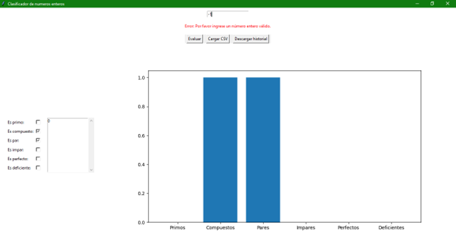

# Reporte técnico

## Introducción Teórica
### Conjuntos numéricos (dentro de los números enteros)

Que es un numero entero? Este tipo de numeros pertenecen al conjunto de los enteros, denotado por Z, el cual engloba tanto los numeros positivos, negativos y al 0. Estos numeros no tienen parte decimal ni fracionaria. 


* Numeros primos: Su principal caracteristica de un numero primo es que es mayor a 1 y solo tiene 2 divisores positivos distintos, el 1 y el mismo; de forma mas sencilla, un numero primo solo puede dividirse exactamente entre 1 y el mismo. Como dato adicional, el numero 1 no es primo ya que solo tiene un divisor y por lo tanto no cumple la caracteristica de tener 2 divisores exactos. Algunos ejemplos son: 2,3,5,7,11...

* Numeros compuestos: Estos numeros son mayores a 1 que cuentan con mas de 2 divisores positivos (todo numero entero mayor a 1 y que no es primo es compuesto), lo que los diferencia de los numeros primos es que los numeros compuestos tienen como divisores mas numeros a parte del 1 y el mismo, ademas, estos numeros pueden ser descompuestos en numeros primos. Algunos ejemplos son:
  * 4: Sus divisores son 1,2 y 4, y se puede descomponer en 2x2.
  * 8: Sus divisores son 1,2,4 y 8, puede ser descompuesto como 2x2x2.
 
* Numeros pares: Es cualquier numero entero que es divisible entre 2, esto significa que al ser dividido entre 2 no hay residuo. Puede ser expresado de la forma 2n, donde n es cualquier numero entero. La suma o resta de numeros pares siempre resultara en otro numero par, la multiplicacion de un numero par con cualquier otro numero entero (par o impar) siempre dara como resultado un numero par, pero la division de un numero par entre uno impar puede o no ser par. Algunos ejemplos son: 2,4,6,8,10...

* Numeros impares: Es un numero entero que no puede ser dividido entre 2, eso significa que al ser dividido entre 2 queda como residuo 1, este tipo de numeros no pueden ser expresados en la forma 2n. Lasuma o resta de 2 numeros impares siempre da como resultado un numero par, la multiplicacion de 2 numeros impares da como resultado un numero impar y la division de un numero impar entre otro numero impar puede o no ser impar. Normalmente, los numeros impares tienen como terminacion 1,3,5,7 o 9. Algunos ejemplos de estos numeros son: 1,3,5,7,9

* Numeros perfectos: Esta clase de enteros se caracteriza por ser un numero que es igual a la suma de sus divisores (excluyendo al mismo numero), es por esta razon que son muy raros de identificar, ya que despues del numero 28 (que es un numero perfecto) el siguiente numero de esa clase es el 496 y luego el 8128. Algunos ejemplos son:
  * 6: Este es el primer numero perfecto, tiene como divisores el 1,2 y 3, si sumamos estos digitos el resultado es 6.
  * 28: Dentro de sus divisores esta el 1,2,4,7 y 14, su suma da como resultado 28, por lo que es un numero perfecto.

*  Numeros deficientes: A diferencia de los numeros perfectos, al sumar los divisores de este numero entero (excluyendo a este mismo) el resultado es menos al propio numero. Por ejemplo:
   * 8: Sus divisores son 1,2 y 4, si realizamos la suma de sus divisores el resultado es 7, el cual es menor a 8.
   * 10: Los divisores son 1,2 y 5, si los sumamos el resultado es 8, que es menor a 10.  


## Desarrollo del Proyecto: **Clasificador de Números Enteros**

### 1. **Resumen Ejecutivo**
El proyecto **Clasificador de Números Enteros** es una herramienta diseñada en Python utilizando la biblioteca Tkinter para la interfaz gráfica y Matplotlib para la visualización de gráficos. El sistema permite evaluar un número introducido por el usuario y clasificarlo en varias categorías matemáticas: números primos, compuestos, pares, impares, perfectos y deficientes. Además, el programa tiene la capacidad de cargar un archivo CSV con números para su evaluación y de guardar el historial de números evaluados.

---

### 2. **Objetivos del Proyecto**
- **Objetivo Principal:** Desarrollar una aplicación interactiva en Python que permita la clasificación y análisis de números enteros.
- **Objetivos Específicos:**
  - Crear funciones matemáticas para clasificar los números en primos, compuestos, pares, impares, perfectos y deficientes.
  - Implementar una interfaz gráfica que facilite la interacción del usuario.
  - Mostrar los resultados de clasificación en tiempo real.
  - Permitir cargar y guardar listas de números a través de archivos CSV.

---

### 3. **Tecnologías Utilizadas**
- **Lenguaje de Programación:** Python 3.x
- **Bibliotecas:**
  - **Tkinter:** Para la creación de la interfaz gráfica de usuario (GUI).
  - **Matplotlib:** Para la visualización de gráficos de barras que muestran los conteos de los diferentes tipos de números.
  - **CSV:** Para cargar y guardar archivos CSV con números.

---

### 4. **Arquitectura del Sistema**
La arquitectura del sistema está basada en una estructura de flujo controlada por la interacción del usuario a través de la GUI. El sistema permite ingresar un número manualmente, cargar una lista de números desde un archivo CSV y guardar los resultados en un archivo.

**Componentes Principales:**
1. **Interfaz Gráfica de Usuario (GUI):** Presenta un campo de texto para la entrada del número, botones para evaluar, cargar y guardar datos, y una lista de los números procesados.
2. **Funciones de Clasificación:** Cada número ingresado se evalúa para determinar si es primo, compuesto, par, impar, perfecto o deficiente mediante funciones específicas.
3. **Gráfico de Resultados:** Los resultados de las evaluaciones se muestran en un gráfico de barras, que se actualiza con cada nuevo número ingresado o cargado.

**Flujo del Sistema:**
1. El usuario ingresa un número o carga un archivo CSV.
2. El sistema clasifica el número según las categorías especificadas.
3. El número se agrega a una lista visual y se muestra en un gráfico con las estadísticas actuales.

---

### 5. **Funciones del Programa**

#### 5.1 **Funciones Matemáticas**
- **`primo(num)`**: Determina si un número es primo. Un número es primo si tiene exactamente dos divisores: 1 y él mismo.
  
  ```python
  def primo(num):
      if num < 2:
          return False
      for i in range(2, int(num ** 0.5) + 1):
          if num % i == 0:
              return False
      return True
  ```

- **`compuesto(num)`**: Determina si un número es compuesto. Un número es compuesto si tiene más de dos divisores.
  
  ```python
  def compuesto(num):
      return not primo(num)
  ```

- **`par(num)`**: Determina si un número es par. Un número es par si es divisible entre 2.
  
  ```python
  def par(num):
      return num % 2 == 0
  ```

- **`impar(num)`**: Determina si un número es impar. Un número es impar si no es divisible entre 2.
  
  ```python
  def impar(num):
      return not par(num)
  ```

- **`perfecto(num)`**: Determina si un número es perfecto. Un número perfecto es igual a la suma de sus divisores propios (excluyendo el propio número).
  
  ```python
  def perfecto(num):
      suma = 1
      for i in range(2, int(num ** 0.5) + 1):
          if num % i == 0:
              suma += i
              if i != num // i:
                  suma += num // i
      return suma == num
  ```

- **`deficiente(num)`**: Determina si un número es deficiente. Un número es deficiente si la suma de sus divisores propios es menor que el número.
  
  ```python
  def deficiente(num):
      return num > suma_divisores(num)
  ```

#### 5.2 **Funciones de Interfaz y Control**
- **`on_button_click()`**: Esta función se ejecuta cuando el usuario hace clic en el botón "Evaluar". Clasifica el número ingresado y actualiza las variables que almacenan los conteos de los diferentes tipos de números.
  
- **`load_csv()`**: Permite al usuario cargar un archivo CSV con números. Los números en el archivo son evaluados de la misma manera que los números ingresados manualmente.
  
- **`save_history()`**: Guarda el historial de números evaluados en un archivo CSV.

- **`plot_graph(a, b, c, d, e, f)`**: Genera un gráfico de barras con los resultados acumulados de los diferentes tipos de números.

---

### 6. **Interfaz de Usuario**
La interfaz gráfica está compuesta por los siguientes elementos:
- **Campo de Entrada:** Permite al usuario ingresar un número entero.
- **Botones:**
  - **Evaluar:** Clasifica el número ingresado.
  - **Cargar CSV:** Permite cargar un archivo CSV con números a clasificar.
  - **Descargar historial:** Guarda los números procesados en un archivo CSV.
- **Etiquetas y Casillas de Verificación:** Muestran los resultados de la clasificación (si el número es primo, compuesto, par, impar, perfecto o deficiente).
- **Lista de Números:** Muestra los números ingresados o cargados.
- **Gráfico de Barras:** Muestra las estadísticas de la cantidad de números de cada tipo (primos, compuestos, etc.).

---

### 7. **Pruebas Realizadas**
- **Pruebas Unitarias:** Cada función de clasificación (como `primo`, `par`, etc.) fue probada individualmente con números conocidos para garantizar su correcto funcionamiento.
- **Pruebas de Integración:** Se realizó una prueba completa de la interfaz para asegurar que los botones y la visualización de resultados se comporten correctamente al cargar datos y al ingresar números.

---

### 8. **Despliegue y Mantenimiento**
- **Despliegue:** El sistema está diseñado para ejecutarse localmente en máquinas con Python 3.x. Requiere las bibliotecas **Tkinter** y **Matplotlib**.
- **Mantenimiento:** Las funciones matemáticas y la interfaz gráfica pueden ser actualizadas para agregar nuevas funcionalidades, como la clasificación de otros tipos de números o mejorar la visualización.

---

## Pruebas realizadas 
El 1 tienen un error, ya que no puede ser compuesto ni perfecto, en la versión final esto estará arreglado.
  
El 55, que se eligió como un numero aleatorio, cumple con las características que el programa marca.
  
El 194340, que se eligió como un numero aleatorio, cumple con las características que el programa 
marca.
  
El 643762761, que se eligió como un numero aleatorio, cumple con las características que el programa 
marca.
  
El 3.1416, que es un numero decimal aleatorio, no se puede evaluar, cosa que es correcta para el propósito del programa.
  
El conjunto de caracteres aleatorios ‘awa’ tampoco se pudieron evaluar, , cosa que es correcta para el propósito del programa.
  
El -1 al no ser un numero entero positivo no es valido para evaluar, cosa que es correcta para el propósito del programa.
  
El 0 tiene un error ya que no puede ser compuesto, aunque si puede ser par, esto será arreglado en la versión final.


## **Conclusiones**
El sistema de clasificación de números cumple con los objetivos propuestos y ofrece una herramienta útil para la clasificación matemática interactiva. La integración de una interfaz gráfica y gráficos visuales permite una experiencia de usuario amigable y eficiente. Se recomienda continuar con la mejora de la interfaz y explorar otras categorías de clasificación.