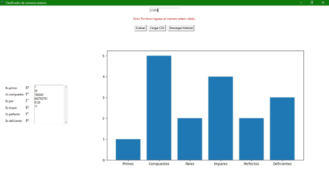

# PRUEBAS REALIZADAS 
El 1 tienen un error, ya que no puede ser compuesto ni perfecto, en la versión final esto estará arreglado.
  
El 55, que se eligió como un numero aleatorio, cumple con las características que el programa marca.
  
El 194340, que se eligió como un numero aleatorio, cumple con las características que el programa 
marca.
  
El 643762761, que se eligió como un numero aleatorio, cumple con las características que el programa 
marca.
  
El 3.1416, que es un numero decimal aleatorio, no se puede evaluar, cosa que es correcta para el propósito del programa.
  
El conjunto de caracteres aleatorios ‘awa’ tampoco se pudieron evaluar, , cosa que es correcta para el propósito del programa.
  
El -1 al no ser un numero entero positivo no es valido para evaluar, cosa que es correcta para el propósito del programa.
  
El 0 tiene un error ya que no puede ser compuesto, aunque si puede ser par, esto será arreglado en la versión final.

